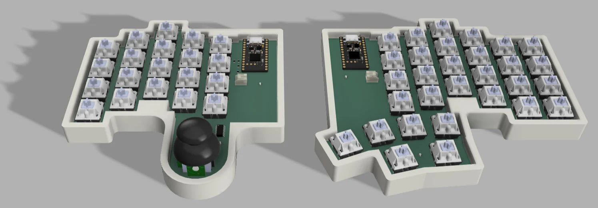
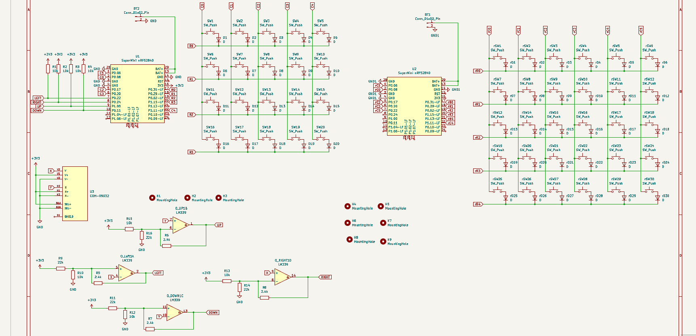
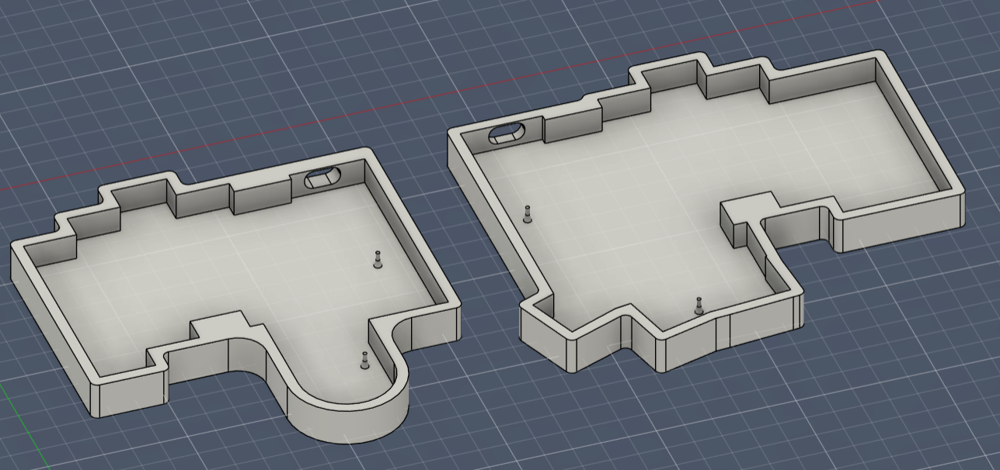

# Joy Board

A custom-built split keyboard with a built in thumb joystick on the left side, runs on zmk firmware and also supports zmk studio. The joystick is inteded to use the movements as key presses, but later is when I realised that it's really good for gaming( I don't really game, maybe thats why).

---

##  Features

-  Split Ergonomic Layout
- Thumb Joystick (Left Side)
- ZMK Studio 
- Schematic

---

##  PCB 

---

## Case

## BOM
- 2x Pro Micro nRF52840
- 50 x 1N5819 SMD Diodes
- 50 x MX-Style switches (and keycaps)
- 1 x COM-09032
- 2 x JST PH 2pin
- 8 x 10k ohm 0805 resistor
- 4 x 22k ohm 0805 resistor
- 4 x 2.4k ohm 0805 resistor
- 4 x LM339 - SOIC14
---
