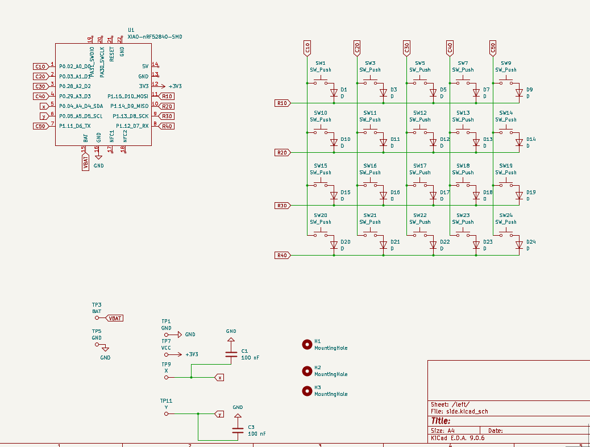
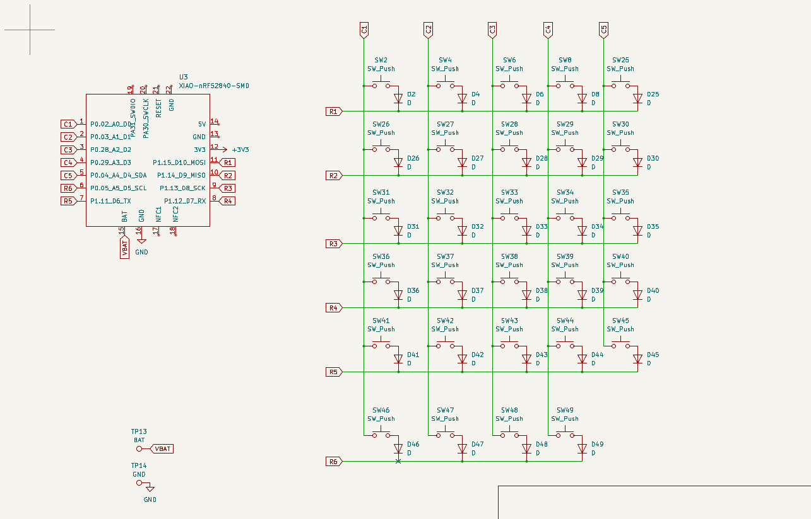
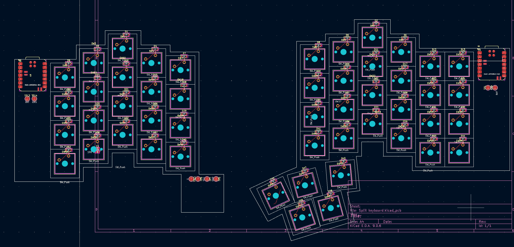

# Joy Board

A custom-built split keyboard designed with a built in thumb joystick.

I included the joystick to use the movements as shortcuts, later is when I realised that it's really good for gaming( I don't really game, maybe thats why).

---

##  Features

###  Split Ergonomic Layout

###  Thumb Joystick (Left Side)

- Directional mapping example:
  - `Up` → Ctrl  
  - `Down` → Shift  
  - `Left` → Alt  
  - `Right` → Custom (layer / macro)

- Also usable as:
  - Arrow keys
  - Scrolling
  - Gaming movemen

###  Upcoming: Trackball Integration
 I am planning on adding this to the left side, so that lazy I wouldn't have to take my hands of just to repostion the text cursor while typing
 (typing this readme, now is when I realised I can use trackpad too)

 ---
 
##  Schematics

### Schematic 1

### Schematic 2

---

##  PCB Layout

---

##  Firmware
To be done

---
